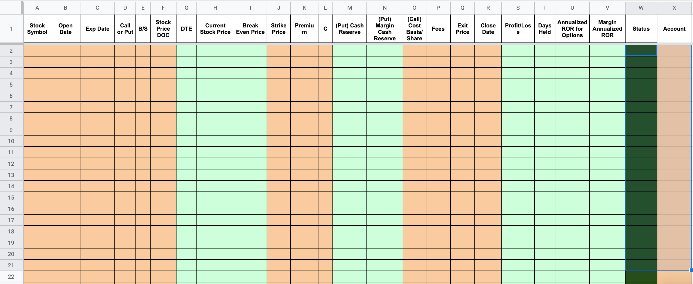

# TradeHist

Project meant to help with quality of life and tracking progress.

---

## Table of Contents

 -[Description](#description)

 -[Goals/Tasks](#goals/tasks)

---

## Description

TradeHist was made to automate the tracking process of options trading. TradeHist uses two wrappers for two different APIs found on the internet and will be discussed in a later section. It takes information returned from the GET request and makes a PUT request to update the row on Google Sheets. The GET request returns a plethora of data, but only a few is recorded onto the Google Sheets. 
 

#### Technologies

 - Python
	* Programming language
 - Google Sheets
	* Used to hold the trading history
 - [gspread](https://gspread.readthedocs.io/en/latest/)
	* Python API for Google Sheets API
 - [tda-api](https://tda-api.readthedocs.io/en/stable/)
	* Wrapper for official TDAmeritrade API

---

## Goals/Tasks

 - Locate/Generate Sheet(In correct format)
 - Implement Google Drive OAuth
 - Implement UI for both OAuth
---
## Disclaimer

**This project is used for educational and recreational purposes. You will need a TDAmeritrade and Google Drive account to use this program.**

[Back To Top](#tradehist)

---
